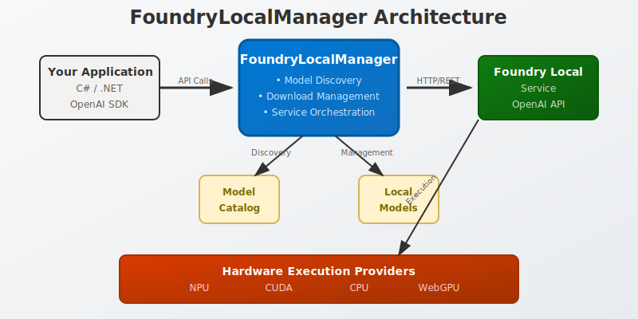

# Building Local AI Applications with FoundryLocalManager: A Developer's Guide



Published on July 4, 2025

As artificial intelligence becomes increasingly central to modern applications, developers are seeking ways to run AI models locally while maintaining the simplicity and power of cloud-based solutions. Microsoft's Foundry Local addresses this need by bringing Azure AI Foundry capabilities to your local device, and at the heart of its C# SDK lies the `FoundryLocalManager` class—a powerful abstraction that makes local AI integration surprisingly straightforward.

## What is Foundry Local?

Before diving into the `FoundryLocalManager` class, let's understand what Foundry Local brings to the table. It's a local version of Azure AI Foundry that enables on-device execution of large language models (LLMs) without requiring an Azure subscription. This means you can:

- Run AI models directly on your hardware with complete privacy
- Avoid recurring cloud costs
- Work offline or in air-gapped environments
- Achieve low-latency responses for real-time applications
- Maintain an OpenAI-compatible API for seamless integration

## Meet the FoundryLocalManager

The `FoundryLocalManager` class serves as the primary interface for .NET developers working with Foundry Local. It encapsulates the complexity of model management, service orchestration, and API communication into a clean, intuitive API that feels familiar to developers already working with cloud-based AI services.

### Key Features

**1. Lifecycle Management**
The class handles the complete lifecycle of the Foundry Local service, from startup to shutdown:

```csharp
var manager = new FoundryLocalManager();
await manager.StartServiceAsync();
// Use the service...
await manager.StopServiceAsync();
```

**2. Model Discovery and Management**
One of the most powerful features is the ability to discover, download, and manage AI models:

```csharp
// List available models in the catalog
var catalogModels = await manager.ListCatalogModelsAsync();

// Download a specific model
var modelInfo = await manager.DownloadModelAsync("phi-3.5-mini");

// Load the model for inference
await manager.LoadModelAsync("phi-3.5-mini");
```

**3. Smart Device Detection**
The class automatically detects and prioritizes execution providers based on your hardware:

- NPU (Neural Processing Unit) for dedicated AI acceleration
- CUDA for NVIDIA GPU acceleration
- CPU execution as a fallback
- WebGPU for web-based scenarios

**4. Progress Tracking**
For large model downloads, the class provides real-time progress updates:

```csharp
await foreach (var progress in manager.DownloadModelWithProgressAsync("large-model"))
{
    switch (progress.Status)
    {
        case DownloadStatus.Progress:
            Console.WriteLine($"Download progress: {progress.Percentage:F1}%");
            break;
        case DownloadStatus.Completed:
            Console.WriteLine("Download completed!");
            break;
        case DownloadStatus.Error:
            Console.WriteLine($"Error: {progress.ErrorMessage}");
            break;
    }
}
```

## Architecture Highlights

### Service Orchestration

The `FoundryLocalManager` doesn't just wrap API calls—it actively manages the underlying Foundry Local service. When you call `StartServiceAsync()`, it:

1. Checks if the service is already running
2. Launches the Foundry Local service if needed
3. Establishes HTTP communication channels
4. Configures appropriate timeouts for long-running operations (like model downloads)

### Intelligent Model Resolution

The class maintains an internal catalog and dictionary system that allows you to reference models by either their full model ID or a friendly alias. This flexibility means you can use simple names like "phi-3.5-mini" instead of remembering complex model identifiers.

### Hardware Optimization

Perhaps most impressively, the `FoundryLocalManager` includes sophisticated logic for execution provider prioritization. On Windows systems, it prefers NPU acceleration when available, falls back to CUDA for NVIDIA GPUs, and uses CPU execution as a final option. This ensures optimal performance regardless of your hardware configuration.

## Practical Usage Patterns

### Quick Start Pattern

For rapid prototyping, the static `StartModelAsync` method provides a one-liner solution:

```csharp
using var manager = await FoundryLocalManager.StartModelAsync("phi-3.5-mini");
// Model is ready for inference at manager.Endpoint
```

### Full Control Pattern

For production applications, you'll likely want more control over the process:

```csharp
var manager = new FoundryLocalManager();
try
{
    await manager.StartServiceAsync();
    
    // Check if model is already cached
    var cachedModels = await manager.ListCachedModelsAsync();
    if (!cachedModels.Any(m => m.Alias == "my-model"))
    {
        await manager.DownloadModelAsync("my-model");
    }
    
    await manager.LoadModelAsync("my-model");
    
    // Use manager.Endpoint for OpenAI-compatible API calls
    var client = new HttpClient { BaseAddress = manager.Endpoint };
    // Make inference requests...
}
finally
{
    await manager.DisposeAsync();
}
```

### Resource Management

The class implements both `IDisposable` and `IAsyncDisposable`, ensuring proper cleanup of HTTP clients and other resources:

```csharp
await using var manager = new FoundryLocalManager();
// Automatic cleanup when scope exits
```

## Integration with OpenAI SDKs

One of the most compelling aspects of `FoundryLocalManager` is how it exposes an OpenAI-compatible endpoint. This means you can use existing OpenAI SDKs and simply point them to the local endpoint:

```csharp
var manager = await FoundryLocalManager.StartModelAsync("phi-3.5-mini");

// Use with OpenAI.NET or similar SDKs
var openAIClient = new OpenAIClient(
    apiKey: manager.ApiKey,
    endpoint: manager.Endpoint
);
```

## Error Handling and Robustness

The class includes comprehensive error handling throughout its operations:

- Model not found in catalog throws descriptive exceptions
- Download failures are captured and reported through progress callbacks
- Service startup issues are propagated with context
- HTTP operations include appropriate timeout configurations

## Performance Considerations

The `FoundryLocalManager` is designed with performance in mind:

- **Caching**: Model catalog information is cached to avoid repeated API calls
- **Lazy Loading**: Catalog data is only fetched when needed
- **Connection Reuse**: HTTP clients are reused across operations
- **Timeout Management**: Generous timeouts (2 hours) accommodate large model downloads

## Future-Proofing

The class design anticipates evolution in the AI landscape:

- Extensible device type enumeration supports future hardware acceleration
- Provider prioritization can be easily adjusted for new execution engines
- The catalog system accommodates new model formats and types
- API compatibility ensures seamless migration between local and cloud deployments

## Conclusion

The `FoundryLocalManager` class represents a thoughtful approach to local AI integration. By abstracting the complexity of service management, model handling, and hardware optimization behind a clean API, it enables developers to focus on building AI-powered features rather than wrestling with infrastructure concerns.

Whether you're building privacy-focused applications, working in offline environments, or simply want to reduce cloud costs, `FoundryLocalManager` provides a robust foundation for local AI development. Its OpenAI-compatible design ensures that existing skills and codebases transfer seamlessly to the local AI paradigm.

As AI continues to move toward edge computing and on-device inference, tools like `FoundryLocalManager` will become increasingly important for developers who want to harness the power of AI while maintaining control over their data and infrastructure.

---

*Ready to get started? Download Foundry Local and explore the full power of local AI development. The future of AI is distributed, and it starts on your local machine.*
